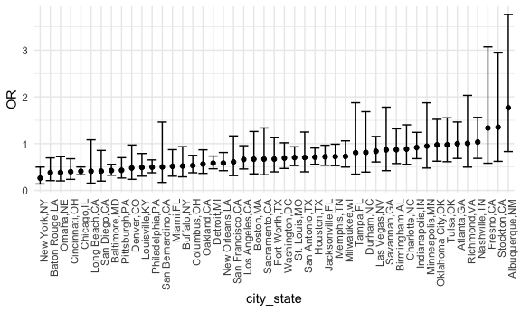
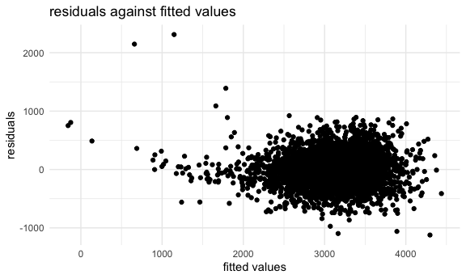
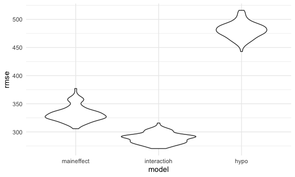
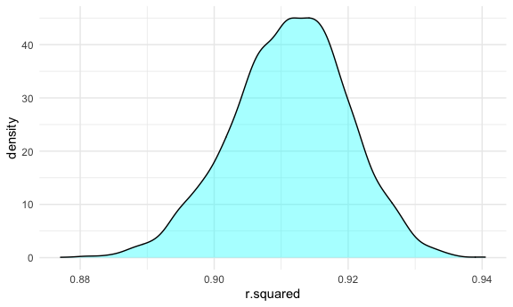
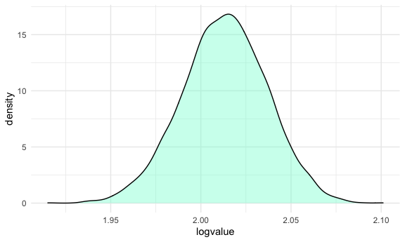

HW6
================

### Problem 1

``` r
homicide_df = 
  read_csv("homicide-data.csv", na = c("", "NA", "Unknown")) %>% 
  mutate(
    city_state = str_c(city, state, sep = ","),
    victim_age = as.numeric(victim_age),
    resolution = case_when(
      disposition == "Closed without arrest" ~ 0,
      disposition == "Open/No arrest" ~ 0,
      disposition == "Closed by arrest" ~ 1
    )
  ) %>% 
  filter(
    victim_race %in% c("White", "Black"),
    city_state != "Tulsa,AL") %>% 
  select(city_state, resolution, victim_age, victim_race, victim_sex)
```

    ## Parsed with column specification:
    ## cols(
    ##   uid = col_character(),
    ##   reported_date = col_double(),
    ##   victim_last = col_character(),
    ##   victim_first = col_character(),
    ##   victim_race = col_character(),
    ##   victim_age = col_double(),
    ##   victim_sex = col_character(),
    ##   city = col_character(),
    ##   state = col_character(),
    ##   lat = col_double(),
    ##   lon = col_double(),
    ##   disposition = col_character()
    ## )

Start with one city.

``` r
baltimore_df =
  homicide_df %>% 
  filter(city_state == "Baltimore,MD")

glm(resolution ~ victim_age + victim_race + victim_sex, 
    data = baltimore_df,
    family = binomial()) %>% 
  broom::tidy() %>% 
  mutate(
    OR = exp(estimate),
    CI_lower = exp(estimate - 1.96 * std.error),
    CI_upper = exp(estimate + 1.96 * std.error)
  ) %>% 
  select(term, OR, starts_with("CI")) %>% 
  knitr::kable(digits = 3)
```

| term              |    OR | CI\_lower | CI\_upper |
| :---------------- | ----: | --------: | --------: |
| (Intercept)       | 1.363 |     0.975 |     1.907 |
| victim\_age       | 0.993 |     0.987 |     1.000 |
| victim\_raceWhite | 2.320 |     1.648 |     3.268 |
| victim\_sexMale   | 0.426 |     0.325 |     0.558 |

Try this across cities.

``` r
models_results_df = 
  homicide_df %>% 
  nest(data = -city_state) %>% 
  mutate(
    models = 
      map(.x = data, ~glm(resolution ~ victim_age + victim_race + victim_sex, data = .x, family = binomial())),
    results = map(models, broom::tidy)
  ) %>% 
  select(city_state, results) %>% 
  unnest(results) %>% 
  mutate(
    OR = exp(estimate),
    CI_lower = exp(estimate - 1.96 * std.error),
    CI_upper = exp(estimate + 1.96 * std.error)
  ) %>% 
  select(city_state, term, OR, starts_with("CI")) 
```

``` r
models_results_df %>% 
  filter(term == "victim_sexMale") %>% 
  mutate(city_state = fct_reorder(city_state, OR)) %>% 
  ggplot(aes(x = city_state, y = OR)) + 
  geom_point() + 
  geom_errorbar(aes(ymin = CI_lower, ymax = CI_upper)) + 
  theme(axis.text.x = element_text(angle = 90, hjust = 1))
```



### Problem 2

Load the data & do some tidying

``` r
birth_df = 
  read_csv("birthweight.csv") %>% 
  janitor::clean_names() %>%
  drop_na()
```

    ## Parsed with column specification:
    ## cols(
    ##   .default = col_double()
    ## )

    ## See spec(...) for full column specifications.

``` r
cleanbirth_df = 
  birth_df %>% 
  mutate(
    babysex = factor(babysex),
    frace = factor(frace),
    mrace = factor(mrace)) %>% 
  mutate(
    frace = case_when(
    frace == 1 ~ "White",
    frace == 2 ~ "Black",
    frace == 3 ~ "Asian",
    frace == 4 ~ "Puerto Rican",
    frace == 8 ~ "Other",
    frace == 9 ~ "Unknown"
    ))%>% 
  mutate(
    mrace =case_when(
      mrace == 1 ~ "White",
      mrace == 2 ~ "Black",
      mrace == 3 ~ "Asian",
      mrace == 4 ~ "Puerto Rican",
      mrace == 8 ~ "Other")
  ) %>% 
  mutate(
    babysex = case_when(
      babysex == 1 ~ "Male",
      babysex == 2 ~ "Female"))
```

Propose a regression model for birthweight. Suppose: the predictors are:
baby’s head circumference + baby’s birth length + mom’s delivery weight
+ gastational age in weeks + mom’s height + mean cigar for mom per day +
mom’s race.

``` r
hypo_model = lm(bwt ~ bhead + blength + delwt + gaweeks + mheight + smoken + mrace, data = cleanbirth_df)

## Make it look better  
broom::glance(hypo_model)
```

    ## # A tibble: 1 x 12
    ##   r.squared adj.r.squared sigma statistic p.value    df  logLik    AIC    BIC
    ##       <dbl>         <dbl> <dbl>     <dbl>   <dbl> <dbl>   <dbl>  <dbl>  <dbl>
    ## 1     0.714         0.714  274.     1203.       0     9 -30529. 61081. 61151.
    ## # … with 3 more variables: deviance <dbl>, df.residual <int>, nobs <int>

``` r
broom::tidy(hypo_model)%>%
  select(-std.error, -statistic) %>% 
  knitr::kable(digits = 3)
```

| term              |   estimate | p.value |
| :---------------- | ---------: | ------: |
| (Intercept)       | \-6112.115 |   0.000 |
| bhead             |    130.119 |   0.000 |
| blength           |     75.295 |   0.000 |
| delwt             |      2.045 |   0.000 |
| gaweeks           |     12.460 |   0.000 |
| mheight           |      5.215 |   0.003 |
| smoken            |    \-4.886 |   0.000 |
| mraceBlack        |   \-72.653 |   0.088 |
| mracePuerto Rican |   \-33.203 |   0.466 |
| mraceWhite        |     72.535 |   0.088 |

Show a plot of model residuals against fitted values.

``` r
hypo_resid_fit_plot =
  cleanbirth_df %>% 
  add_residuals(hypo_model)%>%
  add_predictions(hypo_model)%>%
  ggplot(aes(x = pred, y = resid))+
  geom_point() + 
  labs(
    x = 'fitted values',
    y = 'residuals',
    title = 'residuals against fitted values'
  )

hypo_resid_fit_plot
```


The plot shows that residuals are nearly symmetric by the ‘y = 0’ line.
Even though we have some outliers, we can still say the model is valid.

Compare your model to two others.

``` r
maineffect_model = lm(bwt ~ blength + gaweeks, data = cleanbirth_df)
interaction_model = lm(bwt ~ bhead + blength + babysex + bhead*blength + bhead*babysex + blength*babysex, data = cleanbirth_df)

cv_df = 
  crossv_mc(cleanbirth_df, 100) %>%
  mutate(
    train = map(train, as_tibble),
    test = map(test, as_tibble)) %>% 
  mutate(
    maineffect_model  = map(.x = train, ~lm(bwt ~ blength + gaweeks, data = .x)),
    interaction_model  = map(.x = train, ~lm(bwt ~ bhead + blength + babysex + bhead*blength + bhead*babysex + blength*babysex, data = .x)),
    hypo_model  = map(.x = train, ~lm(bwt ~ wtgain + delwt + fincome, data = .x))) %>% 
  mutate(
    rmse_maineffect = map2_dbl(maineffect_model, test, ~rmse(model = .x, data = .y)),
    rmse_interactioh = map2_dbl(interaction_model, test, ~rmse(model = .x, data = .y)),
    rmse_hypo = map2_dbl(hypo_model, test, ~rmse(model = .x, data = .y)))
```

``` r
cv_df %>% 
  select(starts_with("rmse")) %>% 
  pivot_longer(
    everything(),
    names_to = "model", 
    values_to = "rmse",
    names_prefix = "rmse_") %>% 
  mutate(model = fct_inorder(model)) %>% 
  ggplot(aes(x = model, y = rmse)) + geom_violin()
```


Okay…seems like my hypothetical model is the worst one. So, from the
plot, the interaction model is with the least Root Mean Square Error.
Among those 3 models we should choose the interaction one.

### Problem 3

Download the data using code chunk given.

``` r
weather_df = 
  rnoaa::meteo_pull_monitors(
    c("USW00094728"),
    var = c("PRCP", "TMIN", "TMAX"), 
    date_min = "2017-01-01",
    date_max = "2017-12-31") %>%
  mutate(
    name = recode(id, USW00094728 = "CentralPark_NY"),
    tmin = tmin / 10,
    tmax = tmax / 10) %>%
  select(name, id, everything())
```

    ## Registered S3 method overwritten by 'hoardr':
    ##   method           from
    ##   print.cache_info httr

    ## using cached file: /Users/katherineliu/Library/Caches/R/noaa_ghcnd/USW00094728.dly

    ## date created (size, mb): 2020-10-09 00:14:46 (7.525)

    ## file min/max dates: 1869-01-01 / 2020-10-31

Estimation for R square

``` r
bootstraps_r = 
  weather_df %>% 
  modelr::bootstrap(n = 5000) %>% 
  mutate(
    models = map(strap, ~ lm(tmax ~ tmin, data = .x)),
    results = map(models, broom::glance)) %>% 
  janitor::clean_names() %>%
  unnest(results) %>% 
  select(r.squared)
```

Plot the distribution of r square.

``` r
bootstraps_r %>% 
  ggplot(
    aes(x = r.squared)) + 
  geom_density(fill = 'cyan', alpha = .4)
```



``` r
bootstraps_r%>% 
  summarize(
    ci_lower = quantile(r.squared,0.025), 
    ci_upper = quantile(r.squared, 0.975))
```

    ## # A tibble: 1 x 2
    ##   ci_lower ci_upper
    ##      <dbl>    <dbl>
    ## 1    0.894    0.927

R square values are nearly normally distributed. The mean value is
around 0.91, and the 95% CI is (0.8937522, 0.9270975)

Now go on with the log(beta0 \* beta1)

``` r
bootstraps_log = 
  weather_df %>% 
  modelr::bootstrap(n = 5000) %>% 
  mutate(
    models = map(strap, ~ lm(tmax ~ tmin, data = .x)),
    results = map(models, broom::tidy)) %>%
  unnest(results) %>% 
  select(.id, estimate, term) %>% 
  pivot_wider(names_from = term,
              values_from = estimate)
bootstraps_log=
  bootstraps_log%>% 
  rename(intercept = '(Intercept)') %>%
  mutate(
  logvalue = log((intercept) * tmin))
```

Plot the distribution of log value

``` r
bootstraps_log %>% 
  ggplot(
    aes(x = logvalue)) + 
  geom_density(fill = 'aquamarine', alpha = .4)
```



``` r
bootstraps_log%>% 
  summarize(
    ci_lower = quantile(logvalue, 0.025), 
    ci_upper = quantile(logvalue, 0.975))
```

    ## # A tibble: 1 x 2
    ##   ci_lower ci_upper
    ##      <dbl>    <dbl>
    ## 1     1.97     2.06

Values for log(β<sup>0+β</sup>1) are also normally distributed. The mean
is around 2.0125. The 95% CI is (1.965202, 2.058345)
